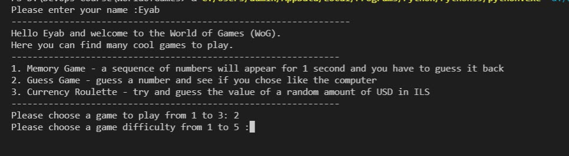
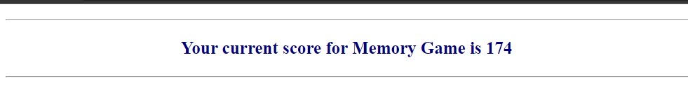
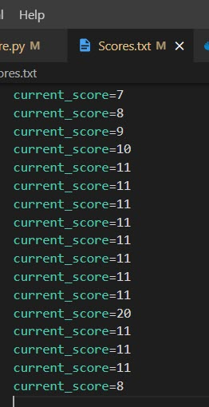
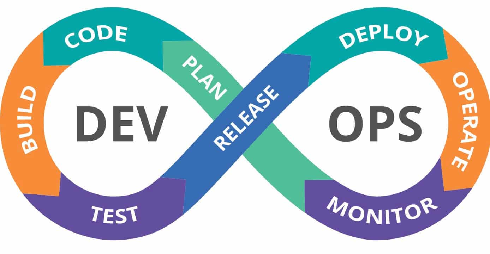
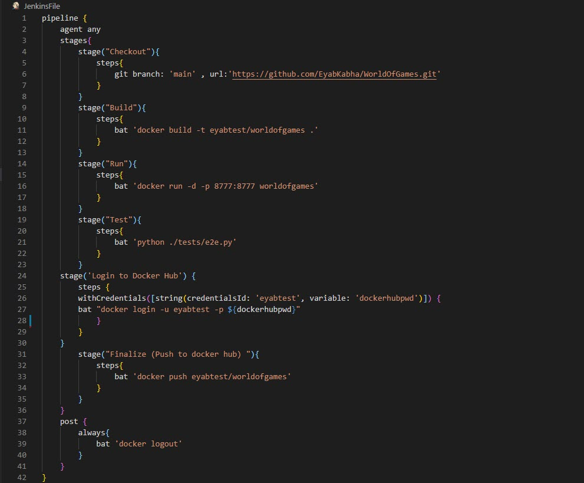
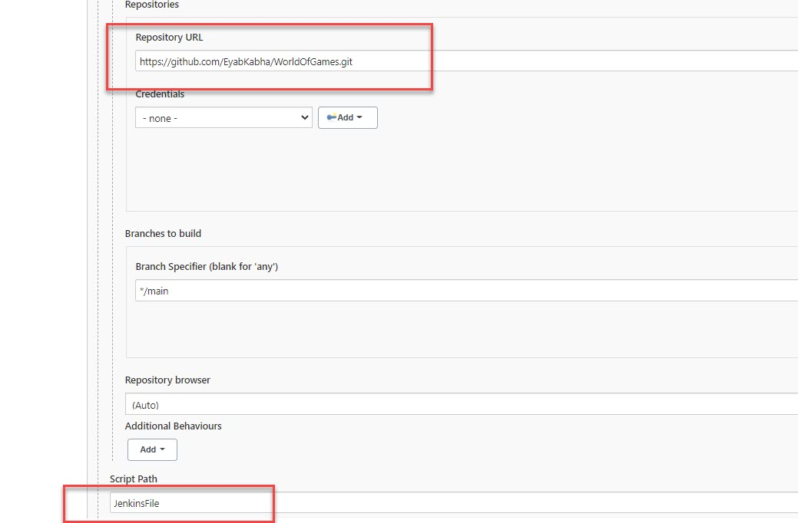
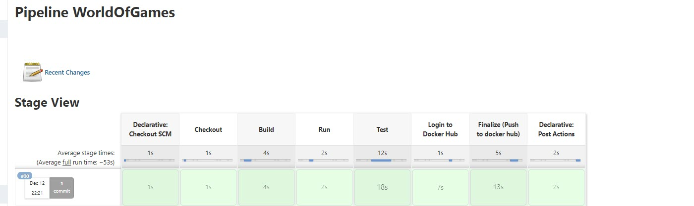
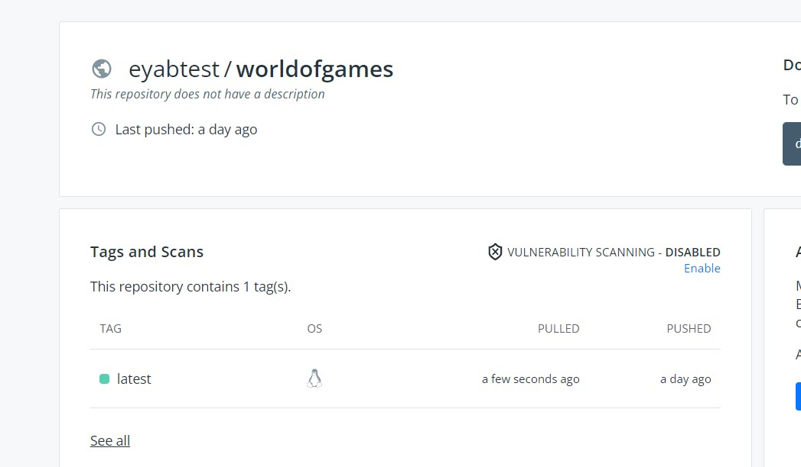

# Welcome to the world of games

Here you can find many cool games to play.

There are three different games to play :

1. Memory Game - a sequence of numbers will appear for 1 second and you have to guess it back

2. Guess Game - guess a number and see if you chose like the computer

3. Currency Roulette - try and guess the value of a random amount of USD in ILS

### How to start a game ? follow the steps below 
* First of all clone the project and then start "MainGame.py" file.
* Will populate a menu with games information.
* Choose the game you want to play.
* Choose the difficulty of the game.

For example : 

In case if you are winning the score will add to the score file and will be displayed into the page.

_____

# CI / CD Part.

Writing a pipeline to imagine the DevOps part 

Below the pipeline : 

From Jenkins side.

First of all, i configred a pipeline that will cloning the project from GitHub as below.

Once running the pipeline, the stages of the pipeline will be created.

And of the end of the pipeline, the project will be publish to "DockerHub" website.

